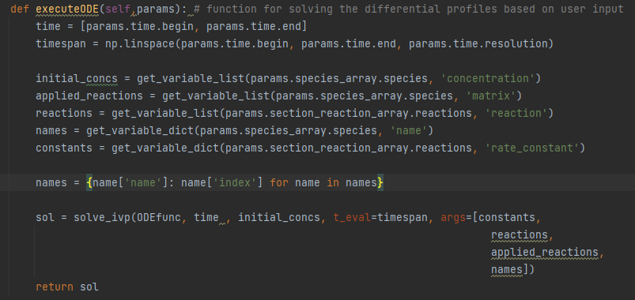
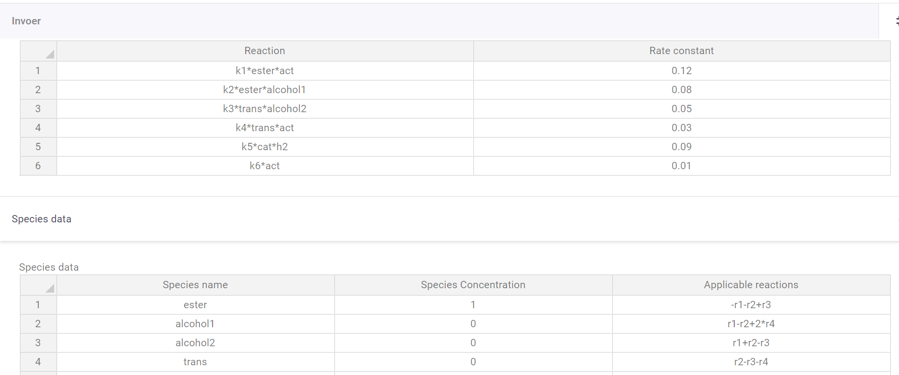
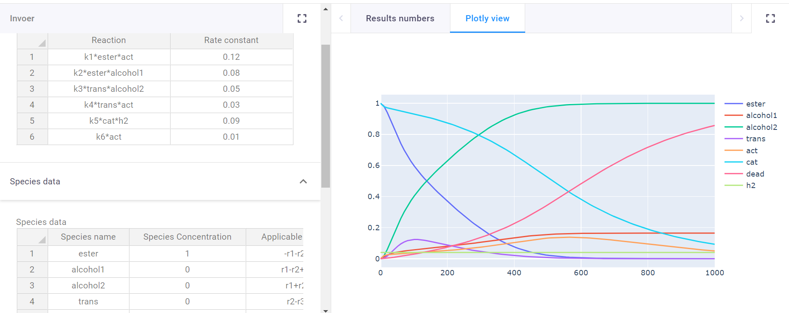

# Differential solver
Sample app for visualizing profiles caused by different differential equations

In this app simulating profiles of different differentials is made easy. The applications was made for predicting
chemical reaction profiles, but more applications where initial value problems need to be solved could qualify.

The app contains two tables, one to define the reactions (notation = Reaction: k1\*A\*B/k2\*B\*clorine\*\*2, Rate constant: 0.1/0.542)
and one to define the species (notation = Name: A/chlorine, Species concentration: 1/3.56, Applicable reactions:
-r1+r2/r4-r3+r6\*3).

There are also input fields to define reaction time, and plot resolution. Since the program finds 
and matches strings it can be easy to use abbreviations for the reaction input table. There is one last table
where these abbreviations can be subsituted with their full names for the plot legend. 

## Using the functionality
There are two ways in which you can use the functionality: 

With VIKTOR, out-of-the-box, using our [free version](https://www.viktor.ai/try-for-free).

Without VIKTOR, in that case you integrate with your own Python code.

This is a snippet of the functionality’s code from app/ODE/controller.py 

Here the table inputs conveniently get made into executable differentials, even though the inputs are strings.
The program shows that you don't need to be a programmer to solve initial value problems with python when the
right infrastructure is in place.

**Apply for a [demo account](https://www.viktor.ai/demo-environment) to get access to this and all other VIKTOR sample applications.**
## ODE's complexity captured easily for chemical reactions

An initial value problem can get complicated quite quickly. You need the variables that change,
their initial values, the way their equations change based on all other factors, and the
constants for those equations, with chemistry having the added complexity that multiple reactions
can influence a species. Luckily VIKTOR has table inputs that make this bulky operation as visually
digestible as it would be in Excel.

In the reaction field all reactions can be put in 
(supports multiplication (\*), and powers(\*\*)),
and with the names a user gives to the species themselves, 
so no working with Ca and Cb, which can quickly become confusing. 
Then all constants k1-kx get a user defined value. All that is left
then is the species table where all participating species are filled in.
All species get an initial concentration. Finally, a user can input the
reactions a species undergoes 
(supports addition (+), subtraction (-), and multiplication (*)),
and whether it reacts or is formed. yielding a graph of their predicted reaction.

